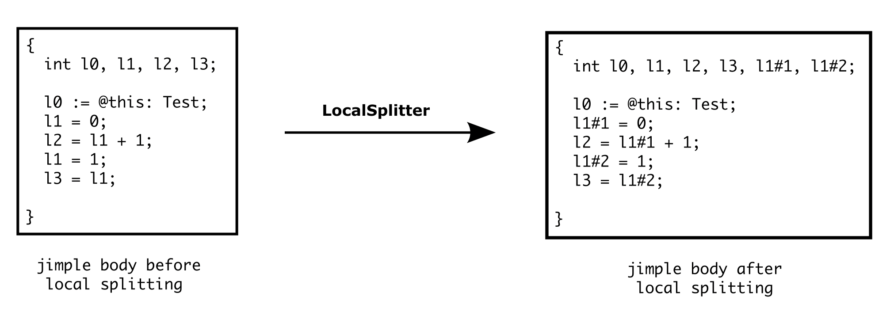
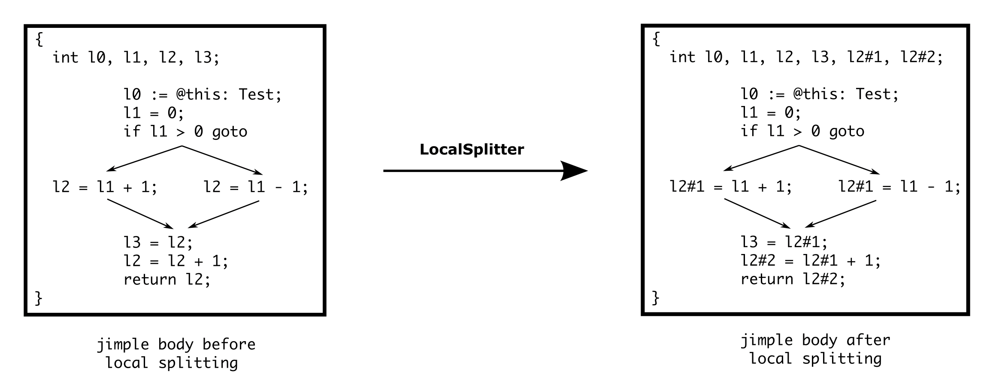
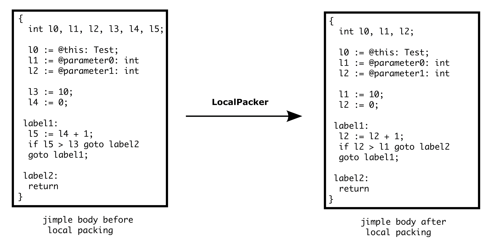

#### LocalSplitter

LocalSplitter is a <code>BodyInterceptor</code> that attempts to identify and separate uses of a local variable (as definition) that are independent of each other by renaming local variable.

Example 1: 

As shown the example above, the local variable <code>l1</code> is defined twice. It can be split up into two new local variables: <code>l1#1</code> and <code>l1#2</code> because of the independency between its two definitions. 

Example 2:

In the second example, the local variable <code>l2</code> is defined thrice. But it cannot be split up into three new local variables as in the first example. Because its definitions in the if-branches are not independent of each other. Therefore, it can be only split up into two local variables as shown in the figure.

#### LocalPacker

LocalPacker is a <code>BodyInterceptor</code> that attempts to minimize the number of local variables used in body by reusing them when possible. It corresponds to the inverse body transformation of LocalSplitter. Note: Every local variable's type should be assigned before running LocalPacker.

Example:

 

