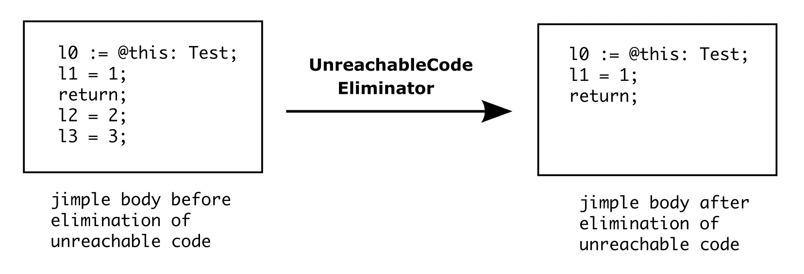
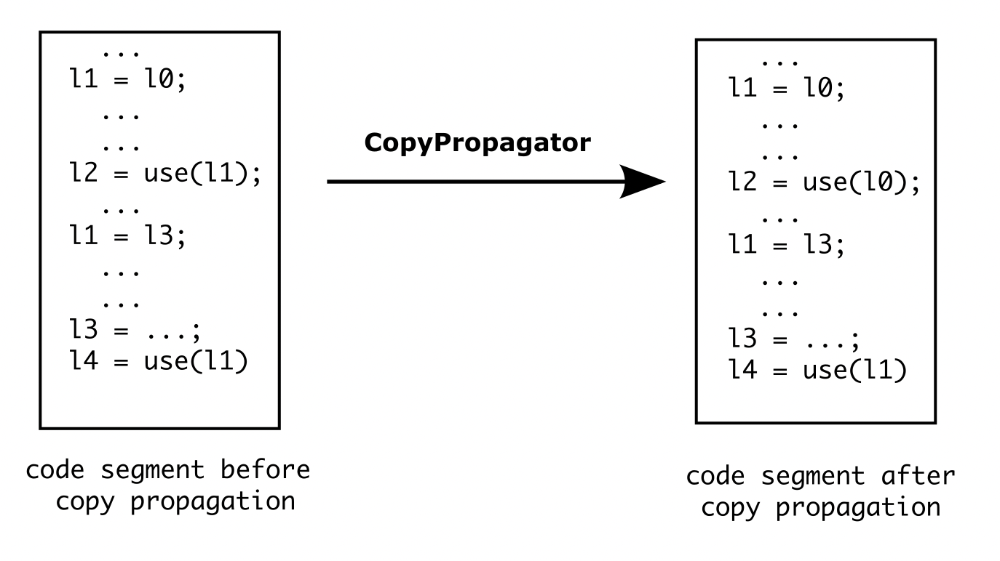

#### LocalSplitter

LocalSplitter is a <code>BodyInterceptor</code> that attempts to identify and separate uses of a local variable (as definition) that are independent of each other by renaming local variables.

Example 1: 


As shown in the example above, the local variable <code>l1</code> is defined twice. It can be split up into two new local variables: <code>l1#1</code> and <code>l1#2</code> because the both definitions are independent of each other. 


Example 2:


In the second example, the local variable <code>l2</code> is defined thrice. But it cannot be split up into three new local variables as in the first example, because its definitions in the if-branches are not independent of each other. Therefore, it can only be split up into two local variables as shown in the figure.


#### LocalPacker

LocalPacker is a <code>BodyInterceptor</code> that attempts to minimize the number of local variables which are used in body by reusing them, when it is possible. It corresponds to the inverse body transformation of LocalSplitter. Note: Every local variable's type should be assigned before running LocalPacker.

Example:


In the given example above, the local variables <code>l1</code>, <code>l3</code> are summarized to be one local variable <code>l1</code>, because they have the same type without interference with each other. Likewise, the local variables <code>l2</code>, <code>l4</code> and <code>l5</code> are summarized to be another local variable <code>l2</code>. Although the local variable <code>l0</code> doesn't interfere any other local variables, it cannot be summed up with other local variables because of its distinctive type.


#### TrapTightener

TrapTightener is a <code>BodyInterceptor</code> that shrinks the protected area covered by each Trap in a Body. 

Example:


We assume in the example above that only the <code>Stmt</code>: <code>l2 := 2</code> might throw an exception caught by the <code>Trap</code> which is labeled with <code>label3</code>. In the jimple body before running the TrapTightener, the protected area covered by the Trap contains three <code>Stmt</code>: <code>l1 := 1; l2 := 2; l2 := 3</code>. But an exception could only arise at the <code>Stmt</code>: <code>l2 := 2</code>. After the implementation of TrapTightener, we will get a contractible protected area which contains only the <code>Stmt</code> that might throw an exception, namely the <code>Stmt</code> : <code>l2 := 2</code>.


#### EmptySwitchEliminator

EmptySwitchEliminator is a <code>BodyInterceptor</code> that removes the empty switch statement which contains only the default case.

Example: 


As shown in the example above, the switch statement in the jimple body always takes the default action. After running EmptySwitchEliminator, the switch statement is replaced with the <code>GotoStmt</code> for default case.


#### UnreachableCodeEliminator

UnreachableCodeEliminator is a <code>BodyInterceptor</code> that removes all unreachable statements.

Example: 



Obviously, the code segment <code>l2 = 2; l3 = 3;</code> is unreachable. It will be removed after running the UreachableCodeEliminator.


#### CopyPropagator

CopyPropagator is a <code>BodyInterceptor</code> that supports the global copy propagation and constant propagation. 

Example for global copy propagation:



Consider a code segment in the following form: 

```
a = b;
...
c = use(a); // a, b, c are local variables
```

According to the copy propagation's definition, the statement <code>c = use(a)</code> can be replaced with <code>c = use(b)</code> iff both conditions are met: 

* <code>a</code> is defined only one time on all the paths from <code>a = b</code> to <code>c = use(a)</code>.
* There're no definitions of <code>b</code> on any path from <code>a = b</code> to <code>c = use(a)</code>.

In the example for global copy propagation, the first used <code>l1</code> is replaced with <code>l0</code>, but the second used <code>l1</code> cannot be replace with <code>l3</code>, because the second condition is not satisfied.
