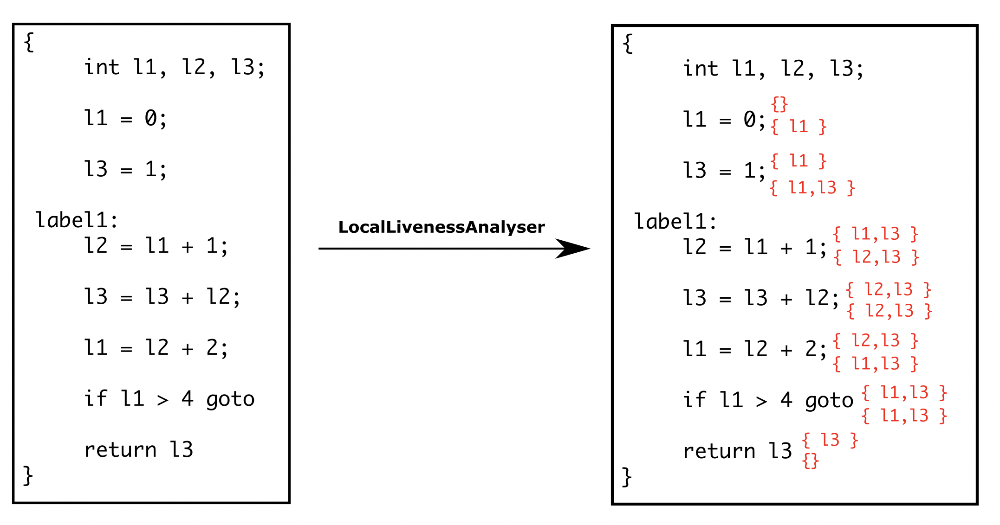

#### LocalLivenessAnalyser

LocalLivenessAnalyser is used for querying for the list of live local variables before and after a given <code>Stmt</code>.

Example:

The live local variables before and after each <code>Stmt</code> will be calculated after generating an instance of LocalLivenessAnalyser as shown the example above. They can be queried by using the methods <code>getLiveLocalsBeforeStmt</code> and <code>getLiveLocalsAfterStmt</code>.

