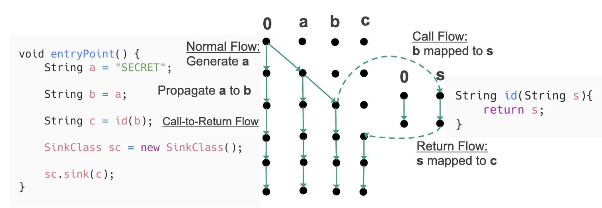

# Taint Analysis Tutorial: Step-by-Step Guide

This tutorial will guide you through implementing taint analysis using SootUp's IFDS framework. You'll learn how to track sensitive data flow from sources to sinks in Java programs.

## What You'll Learn

- How to set up a taint analysis framework
- How to define sources, sinks, and flow functions
- How to handle interprocedural taint propagation
- How to detect and prevent information leaks

## Prerequisites

Before starting, ensure you have:

- Java 8 or higher
- Maven or Gradle build system
- SootUp dependencies in your `pom.xml`:

```xml
<dependencies>
    <dependency>
        <groupId>org.soot-oss</groupId>
        <artifactId>sootup.analysis</artifactId>
        <version>1.3.0</version>
    </dependency>
    <dependency>
        <groupId>de.upb.cs.swt</groupId>
        <artifactId>heros</artifactId>
        <version>1.2.3-SNAPSHOT</version>
    </dependency>
</dependencies>

<repositories>
<repository>
    <id>sonatype-snapshots</id>
    <url>https://oss.sonatype.org/content/repositories/snapshots</url>
    <releases>
        <enabled>false</enabled>
    </releases>
</repository>
</repositories>
```

## Step 1: Understanding the Problem

Taint analysis tracks the flow of sensitive information through a program. It identifies:

- **Sources**: Where sensitive data originates (e.g., user input, secrets)
- **Sinks**: Where data might be leaked (e.g., network calls, logs)
- **Flow**: How data propagates through assignments and method calls

### Example Scenarios

Let's start with simple test cases to understand different taint scenarios:

```java
public static class BasicTaint {
    static String c;

    public void entryPoint() {
        String a = "SECRET";
        String b = a;
        c = b;
        SinkClass sc = new SinkClass();
        sc.sink(c);
    }
}
```

In this example:
- **Source**: `String a = "SECRET"` (sensitive data)
- **Flow**: `a` → `b` → `c` (taint propagation)
- **Sink**: `sc.sink(c)` (potential leak)

## Step 2: Setting Up the Analysis Infrastructure

### 2.1 Analysis Runner Class Structure

First, define the class with its core fields:

```java
protected JavaView view;
protected MethodSignature entryMethodSignature;
protected SootMethod entryMethod;
JavaIdentifierFactory identifierFactory = JavaIdentifierFactory.getInstance();

private JimpleIFDSSolver<?, InterproceduralCFG<Stmt, SootMethod>> solved = null;
```

**Field purposes:**
- `view`: SootUp's representation of the program
- `entryMethodSignature`: Signature of the method to analyze
- `entryMethod`: The actual method object to analyze
- `identifierFactory`: Creates type and method identifiers
- `solved`: Stores the IFDS solver after analysis completes

### 2.2 Main Analysis Entry Point

The main method that orchestrates the entire analysis:

```java
protected JimpleIFDSSolver<?, InterproceduralCFG<Stmt, SootMethod>> executeStaticAnalysis(
        String pathToJar, String targetTestClassName) {
    setupSoot(pathToJar, targetTestClassName);
    runAnalysis();
    if (solved == null) {
        throw new NullPointerException("Something went wrong solving the IFDS problem!");
    }
    return solved;
}
```

**Workflow:**
1. Set up SootUp to load the target class
2. Run the IFDS analysis
3. Verify the solver completed successfully
4. Return the solver for result inspection

### 2.3 Setting Up SootUp

Configure SootUp to load and prepare the target program:

```java
private void setupSoot(String pathToJar, String targetTestClassName) {
    List<AnalysisInputLocation> inputLocations = new ArrayList<>();
    inputLocations.add(new JavaClassPathAnalysisInputLocation(pathToJar, SourceType.Application));

    view = new JavaView(inputLocations);

    JavaClassType mainClassSignature = identifierFactory.getClassType(targetTestClassName);
    Optional<? extends SootClass> scOpt = view.getClass(mainClassSignature);
    if (!scOpt.isPresent()) {
        throw new RuntimeException("Class not found: " + targetTestClassName);
    }
    SootClass sc = scOpt.get();
    Optional<? extends SootMethod> entryMethodOpt = sc.getMethods().stream()
            .filter(e -> e.getName().equals("entryPoint"))
            .findFirst();
    if (!entryMethodOpt.isPresent()) {
        throw new RuntimeException("entryPoint method not found in class: " + targetTestClassName);
    }
    entryMethod = entryMethodOpt.get();
    entryMethodSignature = entryMethod.getSignature();
}
```

**What this does:**
- Creates an analysis input location from the classpath
- Initializes a JavaView to access program classes
- Locates the target class and entry method
- Stores the method signature for ICFG construction

**Key concepts:**
- `AnalysisInputLocation`: Tells SootUp where to find bytecode
- `JavaView`: Provides access to classes and methods
- `entryPoint` method: Our analysis starting point

### 2.4 Running the IFDS Solver

Execute the actual taint analysis:

```java
private void runAnalysis() {
    JimpleBasedInterproceduralCFG icfg =
            new JimpleBasedInterproceduralCFG((View) view, entryMethodSignature, false, false);
    TaintAnalysisProblem problem = new TaintAnalysisProblem(icfg, entryMethod);
    JimpleIFDSSolver<?, InterproceduralCFG<Stmt, SootMethod>> solver =
            new JimpleIFDSSolver(problem);
    solver.solve(entryMethod.getDeclaringClassType().getClassName());
    solved = solver;
}
```

**Analysis steps:**
1. Build the interprocedural control flow graph (ICFG)
2. Create the taint analysis problem instance
3. Initialize the IFDS solver with our problem
4. Run the solver on the target class
5. Store results for inspection

**ICFG parameters:**
- `view`: The SootUp view of the program
- `entryMethodSignature`: Starting point for graph construction
- `false, false`: Flags for enabling/disabling certain features

### 2.5 Querying Analysis Results

Helper method to extract tainted variables at sink points:

```java
public Set<Object> taintedVariablesAtSink(
        JimpleIFDSSolver<?, InterproceduralCFG<Stmt, SootMethod>> analysis) {
    // Find sink statements using simple loop to avoid Optional issues
    for (Stmt stmt : entryMethod.getBody().getStmts()) {
        if (stmt instanceof JInvokeStmt) {
            JInvokeStmt invokeStmt = (JInvokeStmt) stmt;
            Optional<AbstractInvokeExpr> ieOpt = invokeStmt.getInvokeExpr();
            if (ieOpt.isPresent() && ieOpt.get().getMethodSignature().getName().equals("sink")) {
                Set<?> rawSet = analysis.ifdsResultsAt(stmt);
                Set<Object> names = new HashSet<>();
                for (Object fact : rawSet) {
                    names.add(fact);
                }
                return names;
            }
        }
    }
    return new HashSet<>();
}
```

**How it works:**
- Scans all statements in the entry method
- Finds invoke statements calling methods named "sink"
- Retrieves IFDS facts (tainted variables) at those statements
- Returns the set of all tainted facts reaching sinks

This method is crucial for determining if sensitive data leaks to dangerous operations.
**Key components:**
- **JavaView**: Provides access to classes and methods
- **AnalysisInputLocation**: Specifies where to find bytecode
- **Entry method**: Starting point for analysis

## Step 3: Implementing the Taint Analysis Problem

### 3.1 Create the IFDS Problem Class

The core analysis logic extends `DefaultJimpleIFDSTabulationProblem`, which provides the IFDS framework structure. Let's build it step by step.

#### Class Structure and Fields

First, define the class and its core dependencies:

```java
private final SootMethod entryMethod;
private final InterproceduralCFG<Stmt, SootMethod> icfg;
```

**Fields explanation:**
- `entryMethod`: The starting point for our analysis
- `icfg`: Interprocedural control flow graph for navigating method calls

#### Constructor

Initialize the problem with the ICFG and entry method:

```java
public TaintAnalysisProblem(InterproceduralCFG<Stmt, SootMethod> icfg, SootMethod entryMethod) {
    super(icfg);
    this.icfg = icfg;
    this.entryMethod = entryMethod;
}
```

The constructor passes the ICFG to the parent class and stores both dependencies for later use.

#### Initial Seeds

Define where the analysis starts:

```java
@Override
public Map<Stmt, Set<Object>> initialSeeds() {
    return DefaultSeeds.make(
            Collections.singleton(entryMethod.getBody().getStmtGraph().getStartingStmt()),
            zeroValue());
}
```

**What this does:**
- Starts analysis at the first statement of the entry method
- Associates it with the zero value (representing "no taint" initially)
- The IFDS solver will propagate facts from this starting point

#### Flow Functions Factory

Create the factory that provides flow functions for different statement types:

```java
@Override
protected FlowFunctions<Stmt, Object, SootMethod> createFlowFunctionsFactory() {
    return new FlowFunctions<Stmt, Object, SootMethod>() {

        @Override
        public FlowFunction<Object> getNormalFlowFunction(Stmt curr, Stmt succ) {
            return getNormalFlow(curr, succ);
        }

        @Override
        public FlowFunction<Object> getCallFlowFunction(Stmt callStmt, SootMethod destinationMethod) {
            return getCallFlow(callStmt, destinationMethod);
        }

        @Override
        public FlowFunction<Object> getReturnFlowFunction(
                Stmt callSite, SootMethod calleeMethod, Stmt exitStmt, Stmt returnSite) {
            return getReturnFlow(callSite, calleeMethod, exitStmt, returnSite);
        }

        @Override
        public FlowFunction<Object> getCallToReturnFlowFunction(Stmt callSite, Stmt returnSite) {
            return getCallToReturnFlow(callSite, returnSite);
        }
    };
}
```

**This factory delegates to four specialized methods:**
- `getNormalFlow`: Handles regular intraprocedural statements
- `getCallFlow`: Maps arguments to parameters at call sites
- `getReturnFlow`: Maps return values back to callers
- `getCallToReturnFlow`: Preserves local facts across calls

We'll implement each of these in the next step.

#### Zero Value

Define the lattice bottom element:

```java
@Override
protected Object createZeroValue() {
    return new Object() {
        @Override
        public String toString() {
            return "<<zero>>";
        }
    };
}
```

The zero value represents "no taint" and is used as the baseline for all analysis facts.

## Step 4: Implementing Flow Functions

Flow functions define how taint propagates through different statement types. The IFDS framework uses four types:



### 4.1 Normal Flow Function

Handles regular statements within a method:

```java
FlowFunction<Object> getNormalFlow(Stmt currentStmt, Stmt successorStmt) {
    if (currentStmt instanceof JAssignStmt) {
        final JAssignStmt assign = (JAssignStmt) currentStmt;
        final Object leftOp = assign.getLeftOp();
        final Object rightOp = assign.getRightOp();

        if (rightOp instanceof StringConstant) {
            StringConstant str = (StringConstant) rightOp;
            if (str.getValue().equals("SECRET")) {
                return new Gen<>(leftOp, zeroValue());
            }
        }
        return new Transfer<>(leftOp, rightOp);
    }
    return Identity.v();
}
```

**Logic breakdown:**
1. **Source detection**: If `rightOp` is `"SECRET"`, generate taint for `leftOp`
2. **Taint propagation**: Transfer taint from `rightOp` to `leftOp` in assignments
3. **Identity**: Preserve existing taint for other statements

**Key flow function types:**
- `Gen<>(leftOp, zeroValue())`: Generate new taint fact
- `Transfer<>(leftOp, rightOp)`: Transfer taint between variables
- `Identity.v()`: Preserve existing facts

### 4.2 Call Flow Function

Maps arguments to parameters when entering methods:

```java
FlowFunction<Object> getCallFlow(Stmt callStmt, final SootMethod destinationMethod) {
    if (!(callStmt instanceof JInvokeStmt)) {
        return KillAll.v();
    }

    JInvokeStmt invokeStmt = (JInvokeStmt) callStmt;
    Optional<AbstractInvokeExpr> ieOpt = invokeStmt.getInvokeExpr();
    if (!ieOpt.isPresent()) {
        return KillAll.v();
    }

    AbstractInvokeExpr ie = ieOpt.get();
    final List<?> callArgs = ie.getArgs();

    // Simplified mapping for API compatibility
    if (!callArgs.isEmpty() && destinationMethod.getParameterCount() > 0) {
        Object firstCallArg = callArgs.get(0);
        Object firstParam = destinationMethod.getBody().getParameterLocal(0);
        return new Transfer<>(firstParam, firstCallArg);
    }

    return KillAll.v();
}
```

**Process:**
1. Extract method call arguments
2. Map first argument to first parameter
3. Use `Transfer` to propagate taint across the call boundary

### 4.3 Return Flow Function

Maps return values back to call sites:

```java
FlowFunction<Object> getReturnFlow(
        final Stmt callSite, final SootMethod calleeMethod, Stmt exitStmt, Stmt returnSite) {
    if (exitStmt instanceof JReturnStmt) {
        JReturnStmt returnStmt = (JReturnStmt) exitStmt;
        if (callSite instanceof JAssignStmt) {
            JAssignStmt assignStmt = (JAssignStmt) callSite;
            final Object retOp = returnStmt.getOp();
            if (!(retOp instanceof StringConstant)) {
                Object leftOp = assignStmt.getLeftOp();
                return new Transfer<>(leftOp, retOp);
            } else {
                StringConstant str = (StringConstant) retOp;
                if (str.getValue().equals("SECRET")) {
                    final Object leftOp = assignStmt.getLeftOp();
                    return new Gen<>(leftOp, zeroValue());
                }
            }
        }
    }
    return KillAll.v();
}
```

**Handles two cases:**
1. **Tainted return value**: Transfer taint to assignment target
2. **Source in return**: Generate taint if returning `"SECRET"`

### 4.4 Call-to-Return Flow Function

Preserves facts that don't flow through the called method:

```java
FlowFunction<Object> getCallToReturnFlow(final Stmt callSite, Stmt returnSite) {
    return Identity.v();
}
```

## Step 5: Running the Analysis

### 5.1 Execute the Solver

Create and run the IFDS solver:

```java
JimpleBasedInterproceduralCFG icfg = 
    new JimpleBasedInterproceduralCFG((View) view, entryMethodSignature, false, false);
TaintAnalysisProblem problem = new TaintAnalysisProblem(icfg, entryMethod);
JimpleIFDSSolver<?, InterproceduralCFG<Stmt, SootMethod>> solver = 
    new JimpleIFDSSolver(problem);
solver.solve(entryMethod.getDeclaringClassType().getClassName());
```

### 5.2 Analyze Results

Check for tainted data at sink statements:

```java
public void checkLeak(JimpleIFDSSolver<?, InterproceduralCFG<Stmt, SootMethod>> analysis) {
    Set<Object> taintedVars = taintedVariablesAtSink(analysis);
    AbstractInvokeExpr sinkMethod = null;
    for (Stmt stmt : entryMethod.getBody().getStmts()) {
        if (stmt instanceof JInvokeStmt) {
            JInvokeStmt invokeStmt = (JInvokeStmt) stmt;
            Optional<AbstractInvokeExpr> ieOpt = invokeStmt.getInvokeExpr();
            if (ieOpt.isPresent() && ieOpt.get().getMethodSignature().getName().equals("sink")) {
                sinkMethod = ieOpt.get();
                break;
            }
        }
    }

    if (sinkMethod == null) {
        return;
    }

    if (sinkMethod.getArgs().isEmpty()) {
        return;
    }

    Object arg = sinkMethod.getArgs().get(0);
    Object lastAssignment = arg;
    if (arg.toString().contains("stack")) {
        lastAssignment = getLastAssignment(arg);
    }
    Object leaked = null;
    for (Object taintedVar : taintedVars) {
        if (lastAssignment.toString().equals(taintedVar.toString())) {
            leaked = taintedVar;
        }
    }
}
```

## Step 6: Testing Different Scenarios

### 6.1 Basic Taint Propagation

**Test case:**
```java
public static class BasicTaint {
    static String c;

    public void entryPoint() {
        String a = "SECRET";
        String b = a;
        c = b;
        SinkClass sc = new SinkClass();
        sc.sink(c);
    }
}
```

**Expected result**: Leak detected - taint flows from `"SECRET"` to sink

### 6.2 Taint Sanitization

**Test case:**
```java
public static class BasicTaintSanitized {
    public void entryPoint() {
        String a = "SECRET";
        String b = a;
        b = "...";  // sanitization
        SinkClass sc = new SinkClass();
        sc.sink(b);
    }
}
```

**Expected result**: No leak - taint removed by `b = "..."` assignment

### 6.3 Interprocedural Propagation

**Test case:**
```java
public static class FunctionPropagatesTaint {
    private String id(String s) {
        return s;
    }

    public void entryPoint() {
        String a = "SECRET";
        String b = id(a);
        SinkClass sc = new SinkClass();
        sc.sink(b);
    }
}
```

**Expected result**: Leak detected - taint flows through method call

### 6.4 Return Value Sources

**Test case:**
```java
public static class FunctionReturnsTaint {
    private String source() {
        return "SECRET";
    }

    private void sink(String s) {
        // internal sink method
    }

    public void entryPoint() {
        String a = source();
        String b = a;
        sink(b);
    }
}
```

**Expected result**: Leak detected - taint originates from return value

## Step 7: Running All Tests

Execute the complete test suite:
```java
@Test
public void testTaintAnalysis() {
    analyze(BasicTaint.class.getName());
    analyze(BasicTaintSanitized.class.getName());
    analyze(FunctionPropagatesTaint.class.getName());
    analyze(FunctionReturnsTaint.class.getName());
}
```

You can also run it as a standalone program:
```java
public static void main(String[] args) {
    TaintAnalysisTest test = new TaintAnalysisTest();
    test.testTaintAnalysis();
}
```

## Step 8: Understanding the Results

### Analysis Output

For each test case, the analysis will:

1. **Build the interprocedural control flow graph**
2. **Propagate taint facts through the program**
3. **Check if tainted data reaches sink methods**
4. **Report potential information leaks**

### Interpreting Results

- **Leak detected**: Sensitive data can flow to a sink
- **No leak**: Either no sensitive data exists or it's properly sanitized
- **Analysis failed**: Usually indicates setup or configuration issues

## Step 9: Extending the Analysis

### 9.1 Custom Sources and Sinks

Modify the flow functions to recognize domain-specific sources and sinks:

```java
// Custom source detection
if (methodName.equals("getUserInput")) {
    return new Gen<>(leftOp, zeroValue());
}

// Custom sink detection  
if (methodName.equals("sendToServer")) {
    // Check for tainted arguments
}
```

### 9.2 Advanced Sanitization

Model complex sanitization patterns:

```java
if (methodName.equals("validate") || methodName.equals("sanitize")) {
    return KillAll.v(); // Remove all taint
}
```

### 9.3 Field-Sensitive Analysis

Extend to track taint through object fields:

```java
// Handle field assignments
if (leftOp instanceof FieldRef) {
    FieldRef fieldRef = (FieldRef) leftOp;
    // Track taint in object fields
}
```

## Conclusion

You've successfully implemented a taint analysis using SootUp's IFDS framework! 